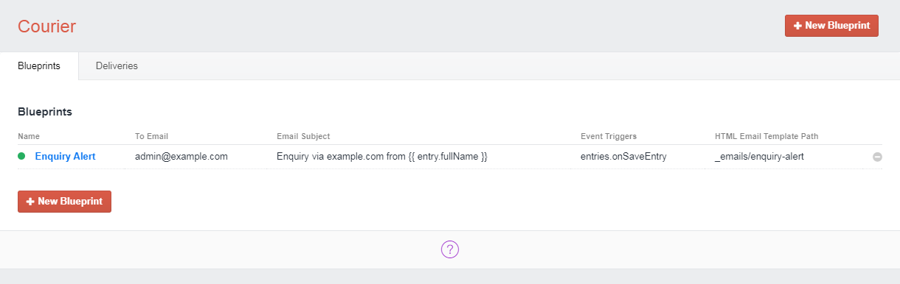
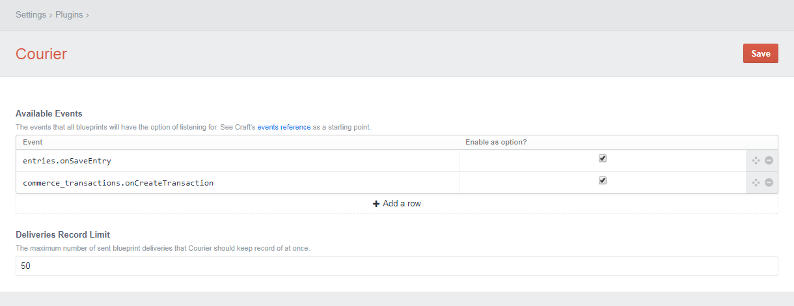

# Courier plugin for Craft CMS

Manage the automated delivery of custom emails, triggered by certain pre-determined events and conditions.

## Requirements

This plugin is tested in and works with Craft 2.6.x, and requires PHP 5.4 or above.

## Installation

To install Courier, follow these steps:

1. Download & unzip the file and place the `courier` directory into your `craft/plugins` directory.
2. Alternatively, you can `git clone https://github.com/therefinerynz/courier.git` directly into your `craft/plugins` folder. You can then update it with `git pull`.
3. Install Courier in the Craft Control Panel under Settings > Plugins.

## Overview

Courier is a [Craft CMS](http://craftcms.com/) plugin that makes it easy to create and send custom emails in Craft in response to specific events. Use “Blueprints” to determine which events and conditions should trigger which emails, general settings rendered with Twig for each email, and which Twig templates should be used for the email body.

## Features

* Listen for any event (including core Craft CMS events or events triggered by a plugin), and conditionally send an email.
* Create and manage Blueprints to configure email settings, and the conditions that should be met before an email is sent.
* Add multiple recipients to an email with the use of a Blueprint's CC and BCC fields.
* Complete control over email template structure, and where email template files should be sourced.
* Ability to use both HTML and Text email templates with each email.
* Track when emails were sent and view any errors that were raised while rendering or trying to send an email in the “Deliveries” section.
* *Most* of a Blueprint's settings fields can be rendered with Twig, and have access to your site's global sets and the fired event parameters.
* All Blueprint email Twig templates also have access to the relevant Blueprint model, as well as your site's global sets and the fired event parameters.

## Settings
From the plugin settings page you can define which events you might watch for when setting up your Blueprints, and how many delivery records should be retained.

### Craft CMS Email Settings

Before setting up Blueprints in Courier, ensure that your Craft CMS installation has email configured correctly.

You can set up your email gateway in the Craft CMS control panel by going to `Settings ⟶ Email`.

We recommend using a transactional email service such as [Mailgun](http://mailgun.com). Further information on troubleshooting email errors in Craft CMS [can be found here](https://craftcms.com/support/troubleshooting-email-errors).

## Usage

A common use case for Courier would be to send email(s) upon the successful save of new Contact message entries submitted by anonymous visitors on the front-end of your site through a contact form. This is made possible by using Courier in conjunction with Pixel & Tonic's [Guest Entries](https://github.com/craftcms/guest-entries/tree/v1) plugin.

If you were to set up two Blueprints for this use case, you could send two different emails after a successful Guest Entries submission.  The first email could be responsible for alerting the admin of a new message that was submitted which could include the relevant entry information that was saved on the entry (message, guest's contact information, etc.). The second email could be to thank the guest for their enquiry.

You could use one of two events to trigger these emails: the `guestEntries.success` event or Craft's `entries.onSaveEntry` event.  We'll use the latter in our example below.

These events have an `EntryModel` param which relates to the given guest entry that was just saved, and this would be made available in each Blueprint as `entry`.

All of a fired event's params are made available in a Blueprint's fields.  The `entries.onSaveEntry` event has an `isNewEntry` param which indicates whether this is a new entry that is being saved.  We'll use this to only send an email on the creation of *new* entries.

### Creating a Blueprint

After you've installed the plugin, go to `Courier` in the control panel sidebar and click “New Blueprint”.

A wiki will soon be set up with additional detail on Blueprint settings. In the interim, the following should provide some guidance on how to set up an email to alert an admin of a Guest Entries form submission:

#### Blueprint Settings

- **Name** - A unique name for this blueprint - for internal use only.  
`Enquiry Alert`

- **Description** - Describe the purpose of this blueprint - for internal use only.  
`To alert the admin of a submission through the contact form.`

- **HTML Email Template Path** - The Twig template used to generate the HTML body of your email.  
Path should be relative to your templates directory.  
`_emails/enquiry-alert`

- **Text Email Template Path** - The Twig template used to generate the plain text body of your email.  
Path should be relative to your templates directory.  
`_emails/enquiry-alert-plain`

#### Email Settings

- **Email Subject**  
`Enquiry via example.com from {{ entry.fullName }}`

- **To Name** - the name of the email recipient  
`Admin`

- **To Email** - the 'TO' address for this email.  
Due to limitations in the way Craft 2 sends emails, you cannot have multiple recipients in the To Email field.  
`admin@example.com`

- **From Name** - the 'From' name Courier will use when sending this email.  
`{{ entry.fullName }}`

- **From Email** - the email address Courier will use when sending this email.  
`postmaster@example.com`

- **Reply To Email** - the reply-to email address that will be set for this email.  Useful if you'd like the admin to be able to hit 'reply' and draft an email addressed to the guest who submitted the enquiry.  
`{{ entry.email }}`

- **CC and BCC Email(s)** - To add multiple email addresses to a Blueprint's CC or BCC fields, simply separate each email address with a comma or semicolon.

#### Event Settings

- **Event Triggers** - which event(s) you want to trigger a Blueprint's email. Additional custom events can be added in the plugin settings page.  
`entries.onSaveEntry`

- **Event Trigger Conditions** - Twig conditions to run after a watched event is fired.

    - Have this field's code evaluate to a single `true` if you want the event to trigger the Blueprint's email.
    - Have it evaluate to a single `false` if the blueprint should ignore the event.  
    
    You might have the Guest Entries plugin set up to accept front end submissions from guests, and save entries to a section with an ID of `11`. Enter the following to trigger an email when a new entry is created in that section:  
    `{{ entry.sectionId == '11' and isNewEntry ? 'true' : 'false' }}`

## TODO

* Set up WIKI.

## Feedback

If you come across any problems with Courier, or if you have any suggestions or questions, please open an issue.

## Credits

Brought to you by [The Refinery](http://therefinery.co.nz).

